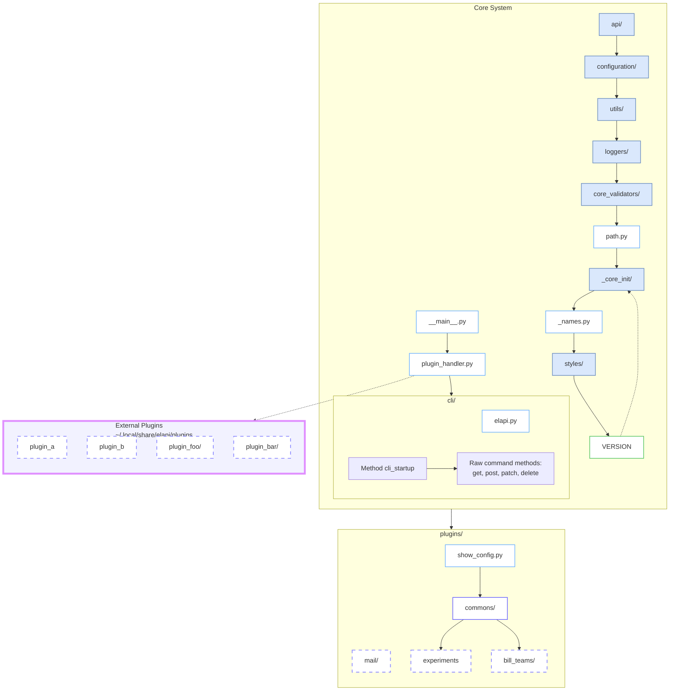

```mermaid
graph TB
    %% Core system components
    subgraph CoreSystem["Core System"]
        direction TB
        
        subgraph CLI["cli/"]
            elapi[elapi.py]
            cli_startup["Method cli_startup"]
            raw_commands["Raw command methods:<br/>get, post, patch, delete"]
            
            cli_startup --> raw_commands
        end
        
        main[__main__.py]
        plugin_handler[plugin_handler.py]
        
        %% Core directories
        api[api/]
        configuration[configuration/]
        utils[utils/]
        loggers[loggers/]
        core_validators[core_validators/]
        core_init[_core_init/]
        
        %% Other core files
        path[path.py]
        names[_names.py]
        styles[styles/]
        VERSION[VERSION]
        
        %% Core relationships
        main --> plugin_handler
        plugin_handler --> CLI
        api --> configuration
        configuration --> utils
        utils --> loggers
        loggers --> core_validators
        core_validators --> path
        path --> core_init
        core_init --> names
        names --> styles
        styles --> VERSION
    end
    
    %% Internal plugins
    subgraph InternalPlugins["plugins/"]
        direction TB
        mail[mail/]
        commons[commons/]
        show_config[show_config.py]
        experiments[experiments]
        bill_teams[bill_teams/]
        
        show_config --> commons
        commons --> experiments
        commons --> bill_teams
    end
    
    %% External plugins
    subgraph ExternalPlugins["External Plugins<br/>~/.local/share/elapi/plugins"]
        direction TB
        plugin_a[plugin_a]
        plugin_b[plugin_b]
        plugin_foo[plugin_foo/]
        plugin_bar[plugin_bar/]
    end
    
    %% Main connections
    CoreSystem --> InternalPlugins
    plugin_handler -.-> ExternalPlugins
    VERSION -.-> core_init
    
    %% Styling
    classDef coreFile fill:#ffffff,stroke:#6db1ff,stroke-width:1.5px
    classDef coreDir fill:#dae8fc,stroke:#6c8ebf,stroke-width:1.5px
    classDef pluginDir fill:#ffffff,stroke:#9391ff,stroke-width:2px,stroke-dasharray: 8 8
    classDef greenFile fill:#ffffff,stroke:#54c45e,stroke-width:1.5px
    classDef purpleDir fill:#ffffff,stroke:#635dff,stroke-width:1.5px
    classDef externalPlugin fill:#f2f2ff,stroke:#e08fff,stroke-width:4.5px
    
    class elapi,plugin_handler,main,show_config,path,names coreFile
    class api,configuration,utils,loggers,core_validators,core_init,styles coreDir
    class mail,experiments,bill_teams,plugin_foo,plugin_bar,plugin_a,plugin_b pluginDir
    class VERSION greenFile
    class commons purpleDir
    class ExternalPlugins externalPlugin
```